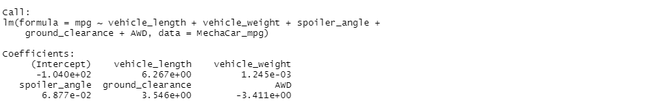

# MechaCar

## Linear Regression to Predict MPG
Using R to generate a linear regression formula for the dataset we were given the following data:

From this we can see that the formula for finding mpg of the vehicle is 6.267*vehicle length + .001*vehicle weight + .069*spoiler angle + 3.546 ground clearance - 3.411 AWD - 104. We can see from the weights listed here that the vehicle weight and spoiler angles impact on the mileage of the vehicle is nearly non-existent. We can therefore say that vehicle length, ground clearance and AWD added a non-random level of variance to the equation
